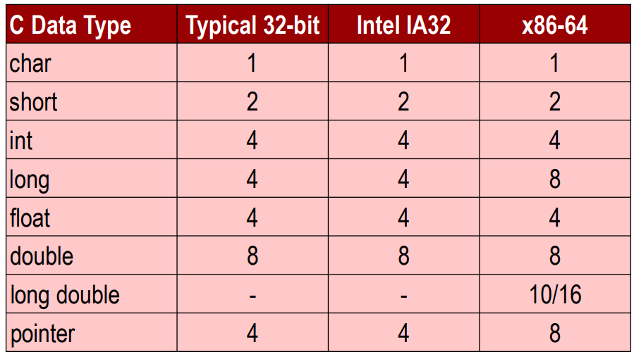
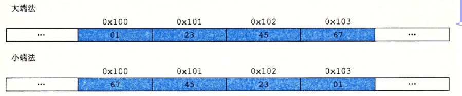
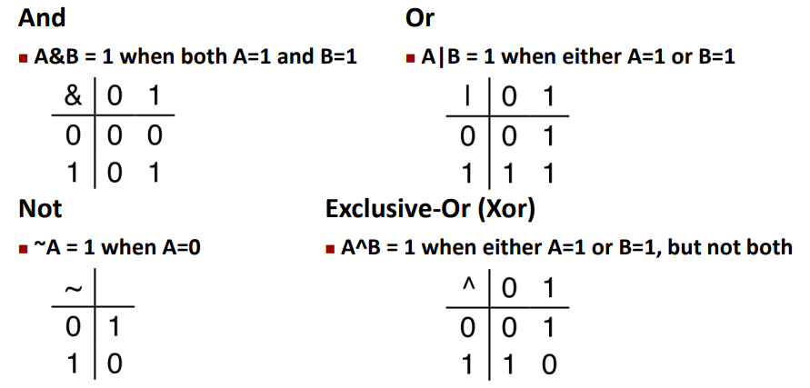

# Bits, Bytes, and Integers

----

| Hex  | Dec  | Bin  |
| ---- | ---- | ---- |
| 0    | 0    | 0000 |
| 1    | 1    | 0001 |
| 2    | 2    | 0010 |
| 3    | 3    | 0011 |
| 4    | 4    | 0100 |
| 5    | 5    | 0101 |
| 6    | 6    | 0110 |
| 7    | 7    | 0111 |
| 8    | 8    | 1000 |
| 9    | 9    | 1001 |
| A    | 10   | 1010 |
| B    | 11   | 1011 |
| C    | 12   | 1100 |
| D    | 13   | 1101 |
| E    | 14   | 1110 |

----

---

### 大小端

---

## 位运算

### 布尔代数

---

### C语言中位运算与逻辑运算的区别

Logic Operations in C: ||, &&, !

eg. 

+ !0x41 ➙ 0x00

+ 0x69 && 0x55 ➙ 0x01

+ p && *p (avoids null pointer access)

---

### 移位运算

#### 左移位: `x<<y`

+ 末位补0

#### 右移位: `x>>y`

+ 逻辑右移 (首位补0) ---- C中无符号数的移位
+ 算数右移 (首位补符号位) ---- C中有符号数的移位
+ ~~在Java中, 算数右移用`>>>`~~

---

#### C\C++语言中移位范围的限制

> ISO/IEC 9899:1999 6.5.7 Bitwise shift operators ¶3
>
> The integer promotions are performed on each of the operands. The type of the result is that of the promoted left operand. If the value of the right operand is negative or is greater than or equal to the width of the promoted left operand, the behavior is undefined.

**tldr**: $0\le y<width(x)$, 否则移位的结果未定义

eg. : 若x为int, 则 $0\le y<32$

---

## Integers

### 表示:

+ 原码(无符号数): $X_U=B 2 U(X)=\sum_{i=0}^{w-1} x_{i} \cdot 2^{i}$
  + $0\le X_U \le UMax_w=2^w-1$

+ 补码(有符号数): $X_T=B 2 T(X)=-x_{w-1} \cdot 2^{w-1}+\sum_{i=0}^{w-2} x_{i} \cdot 2^{i}$
  + $-2^{w-1}=TMin_w \le X_T \le TMax_w=2^{w-1}-1$
  + $-X= \sim X+1$
  + Examples for W = 32: TMIN = -2,147,483,648=0b8000_0000 , TMAX = 2,147,483,647=0b7FFF_FFFF

---

### 有符号数和无符号数的转换:

如果在单个表达式中混合使用无符号和有符号，**有符号值隐式转换为无符号**

包含 $<, >,==, <=, >=$

---

### 扩展与截断

#### 扩展:

+ Unsigned: 补0
+ Signed: 补符号位 (可以保证补码值不变)

#### 截断:

+ 直接截断
+ U: $x'=x \ mod \ 2^k$
+ T:  $x'=U2T_k(x \ mod \ 2^k)$

---

### 整数运算--- +,-,*,/, 移位

---

#### 加法+

